# Customer Churn Prediction & Retention Strategy

**5,630 customers. 24.7% churn rate. $2.7 million in annual revenue at risk. A $23,357 retention budget that was projected to save $503,848. This project built the model, scored every customer, designed the intervention plan and calculated the ROI — end to end.**

---

## 1. Project Overview

I built this project around a question most e-commerce businesses avoid answering directly: which specific customers are about to leave, and what is the cheapest way to stop them?

The common approach is to react — a customer cancels, you send a win-back email. This project took the opposite direction. Using 5,630 customer records with 21 features covering behaviour, purchase history, complaints and satisfaction, I trained four classification models to predict churn probability before it happened. Every customer ended up with a probability score and a risk tier. The final output was not a model — it was a retention investment plan with costs and expected savings per segment that could go directly to a marketing team.

The best model was Logistic Regression at 0.8072 AUC-ROC, selected over XGBoost not just because the headline score was higher but because the 5-fold cross-validation variance was the tightest (±0.004 versus ±0.015 for XGBoost), meaning it generalised more reliably to new customers.

---

## 2. Business Problem

The business knew its total churn rate was around 25%. What it did not know was which 25% — and more importantly, which of those customers were worth spending money to retain versus which ones were going to churn regardless.

Treating all at-risk customers identically was expensive and ineffective. Spending $20 on personal outreach for a customer generating $89 per month was a completely different financial decision from spending $20 on someone paying $40. The model had to do two things: predict who was going to leave, and rank them in a way that let the business allocate retention spend based on expected return.

The threshold decision mattered more than most churn model writeups acknowledge. At the default 0.50 threshold, the model missed too many actual churners — and in this problem, missing a churner was 10 times more expensive than spending on someone who was not going to leave anyway. The business-cost-minimising threshold came out at 0.21, which is what I used for the final risk segmentation.

---

## 3. Dashboard Preview

| Visual | What it shows |
|:---|:---|
| 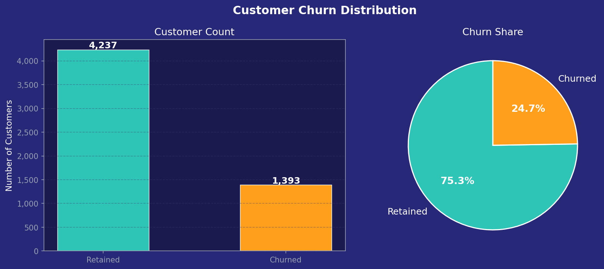 | Overall churn rate breakdown — 24.7% across 5,630 customers |
| 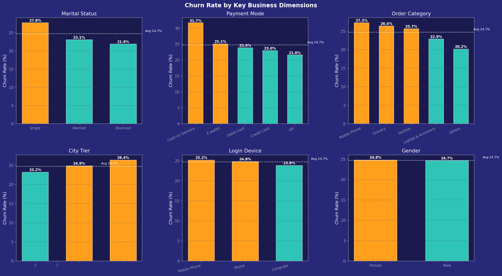 | Churn rate by login device, payment mode, marital status and other categorical features |
| 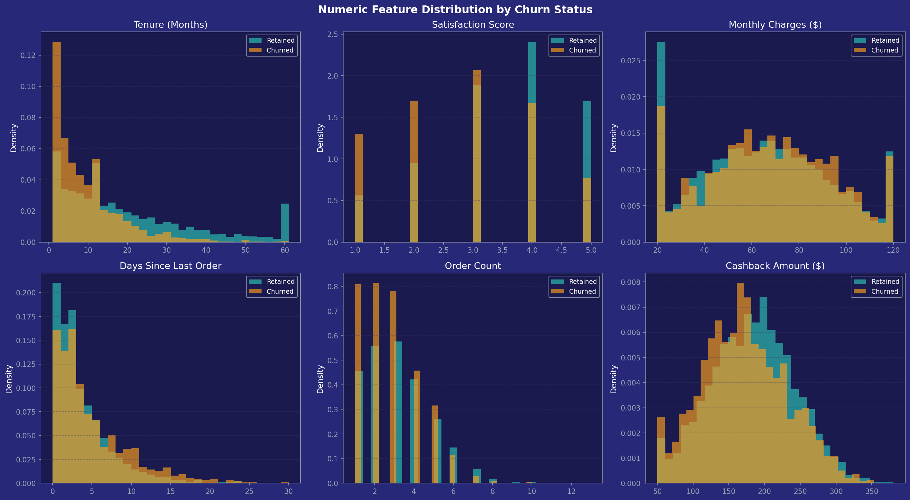 | Tenure, satisfaction, recency and order count distributions for churned vs retained |
| 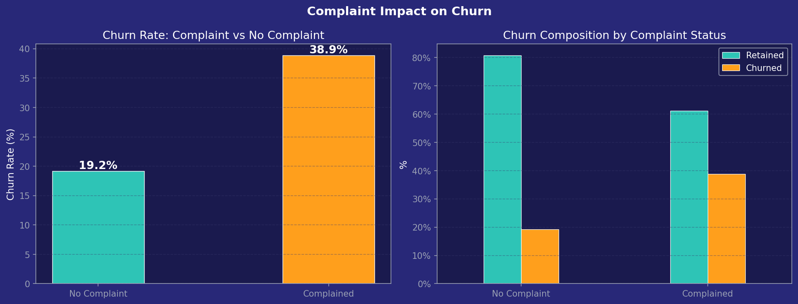 | How filing a complaint changes churn probability |
| 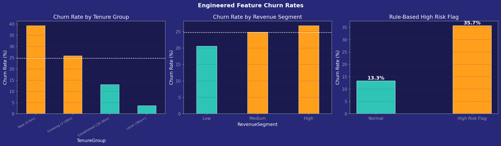 | CLV proxy, tenure groups and engagement score distributions |
| 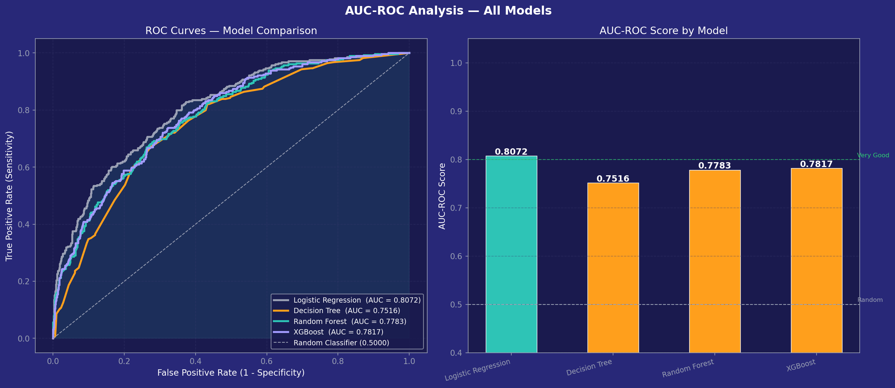 | ROC curves for all four models — Logistic Regression, Decision Tree, Random Forest, XGBoost |
| 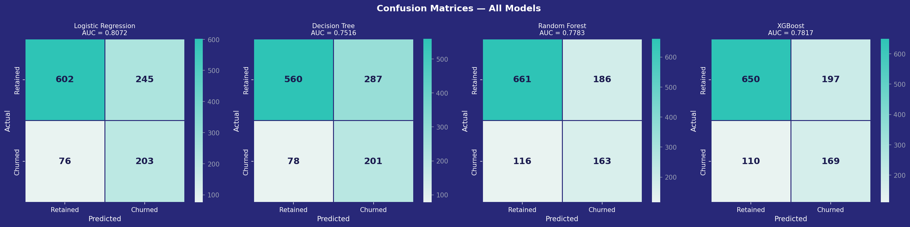 | Confusion matrices for all four models side by side |
| 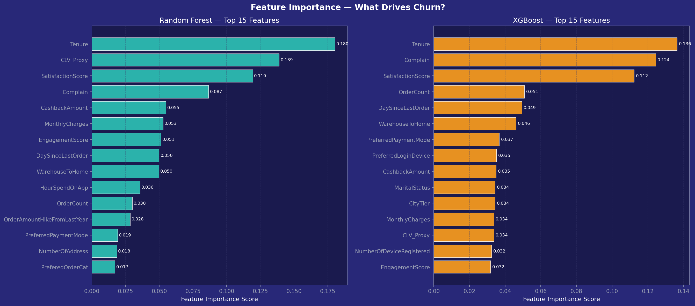 | Random Forest and XGBoost feature importance — top 10 churn drivers |
| 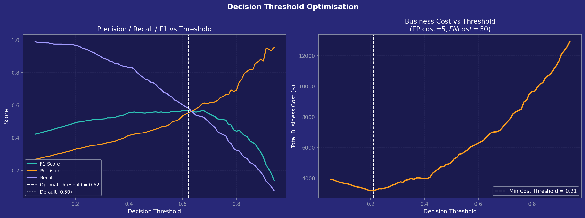 | F1 score and business cost curves across threshold values |
| 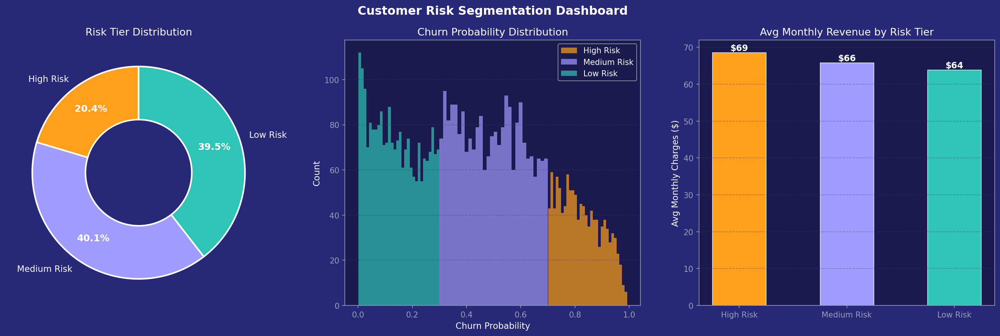 | All 5,630 customers split into High, Medium and Low risk tiers |
| 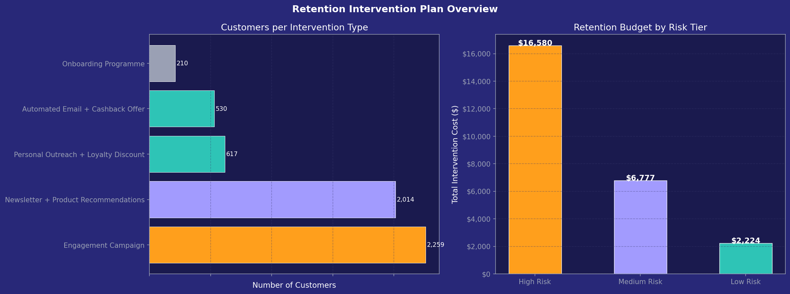 | Retention action and cost per segment |
| 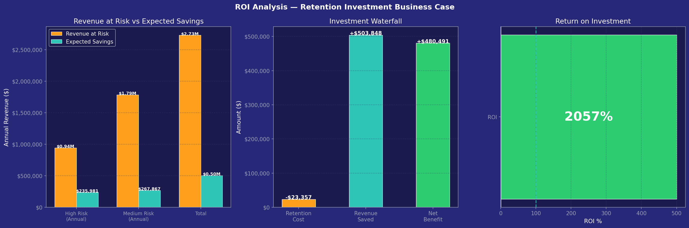 | Revenue at risk, intervention budget and expected savings by segment |
|  | All key metrics on one page for leadership review |

---

## 4. Key Business Insights

**The model achieved 0.8072 AUC-ROC — firmly in the "very good" range.**

Four models were trained and compared. Logistic Regression came out on top:

| Model | AUC-ROC | F1 Score | CV AUC (5-fold) |
|:---|:---|:---|:---|
| **Logistic Regression** | **0.8072** | **0.5585** | **0.8178 ± 0.004** |
| XGBoost | 0.7817 | 0.5240 | 0.7944 ± 0.015 |
| Random Forest | 0.7783 | 0.5191 | 0.7905 ± 0.014 |
| Decision Tree | 0.7516 | 0.5241 | 0.7244 ± 0.023 |

The cross-validation variance column was what settled the decision. XGBoost had a higher peak on some runs, but its ±0.015 variance band was nearly four times wider than Logistic Regression's ±0.004. A model that generalises more consistently to unseen customers was more useful here than one that had a higher ceiling but wider variance.

**Tenure was the single most important churn predictor.**

The Random Forest feature importance showed Tenure at the top (0.1805), followed by the CLV Proxy I engineered (0.1390) and Satisfaction Score (0.1194). New customers — those in their first six months — churned at significantly higher rates than established ones. This pointed to the onboarding period as the highest-leverage retention window, not the long-tenure customers a lot of retention campaigns target.

The top 10 churn drivers in order:

| Feature | Importance | What it means |
|:---|:---|:---|
| Tenure | 0.1805 | Short-tenure customers churn most — fix onboarding first |
| CLV Proxy | 0.1390 | Low lifetime value customers are harder to retain |
| Satisfaction Score | 0.1194 | Low scorers churn heavily and predictably |
| Complain | 0.0866 | Filing a complaint is a major risk signal regardless of resolution |
| Cashback Amount | 0.0550 | Lower cashback engagement = lower stickiness |
| Monthly Charges | 0.0529 | Price sensitivity at lower spend levels |
| Engagement Score | 0.0512 | Composite of app time, orders and coupons used |
| Days Since Last Order | 0.0499 | Recency matters — going quiet is an early warning |
| Warehouse to Home | 0.0498 | Delivery time friction affects retention |
| Hours Spent on App | 0.0357 | Low app usage correlates with disengagement |

**The complaint signal stood out on its own.** Customers who filed a complaint and received a low satisfaction score were among the highest immediate churn risk in the dataset. This signal does not require a model — a CRM team monitoring complaint resolution today could act on it without waiting for weekly scoring runs.

**Risk segmentation across all 5,630 customers:**

| Risk Tier | Customers | Share | Actual Churn Rate |
|:---|:---|:---|:---|
| High Risk | 1,147 | 20.4% | 60.2% |
| Medium Risk | 2,259 | 40.1% | 25.5% |
| Low Risk | 2,224 | 39.5% | 5.6% |

**The retention plan converted the model output into a spending decision:**

| Segment | Customers | Intervention | Cost | Total Budget |
|:---|:---|:---|:---|:---|
| High Risk, High Revenue (≥$65/mo) | 617 | Personal outreach + loyalty discount | $20 | $12,340 |
| High Risk, Low Revenue (<$65/mo) | 530 | Automated email + cashback offer | $8 | $4,240 |
| Medium Risk | 2,259 | Engagement campaign | $3 | $6,777 |
| Low Risk — New Customers | 210 | Onboarding programme | $1 | $210 |
| Low Risk — Established | 2,014 | Newsletter + recommendations | $1 | $2,014 |

**The ROI calculation used conservative assumptions — 25% success rate for High Risk, 15% for Medium Risk:**

| | High Risk | Medium Risk | Total |
|:---|:---|:---|:---|
| Annual Revenue at Risk | $943,924 | $1,785,780 | $2,729,704 |
| Retention Budget | $16,580 | $6,777 | $23,357 |
| Expected Revenue Saved | $235,981 | $267,867 | $503,848 |
| Net Benefit | | | **$480,491** |

Every $1 spent on retention was projected to recover $21.57 in annual revenue at the conservative success rates used. The cost of not acting was significantly higher than the cost of running the campaign.

---

## 5. Project Architecture

```
Raw CSV (5,630 customer records)
        ↓
Data Quality Audit — missing values, duplicates, negative checks
        ↓
Median Imputation — Tenure, HourSpendOnApp,
                    OrderAmountHikeFromLastYear, DaySinceLastOrder
        ↓
Feature Engineering — CLV_Proxy, TenureGroup,
                      RevenueSegment, EngagementScore, HighRiskFlag
        ↓
Preprocessing — OrdinalEncoder (categoricals), StandardScaler,
                80/20 stratified train-test split
        ↓
Model Training — Logistic Regression, Decision Tree,
                  Random Forest, XGBoost
        ↓
Model Selection — AUC-ROC + CV variance (Logistic Regression wins)
        ↓
Threshold Optimisation — F1-optimal (0.62) vs business-cost (0.21)
        ↓
Full Customer Scoring — all 5,630 customers scored and tiered
        ↓
Retention Plan & ROI Model
        ↓
Exports — clean CSV, Power BI dataset, model .pkl, visuals
```

**Why the threshold mattered.** At the default 0.50 threshold, the model was too conservative — it missed actual churners to avoid false positives. Given that the cost of missing a churner was estimated at roughly 10 times the cost of an unnecessary retention spend, shifting the threshold down to 0.21 was the financially correct decision. The threshold optimisation chart showed this crossover point explicitly so the choice was transparent rather than arbitrary.

---

## 6. Tech Stack

| Tool | Role |
|:---|:---|
| Python | End-to-end pipeline |
| pandas, NumPy | Data cleaning, feature engineering, scoring |
| scikit-learn | Logistic Regression, Decision Tree, Random Forest, preprocessing, cross-validation |
| XGBoost | Gradient boosting model |
| Matplotlib, Seaborn | All 13 visualisations |
| pickle | Model serialisation for production use |
| Jupyter Notebook | Interactive analysis environment |

---

## 7. Repository Structure

```
customer-churn-prediction/
│
├── Customer_Churn_Prediction_Model.ipynb   # Main notebook — 15 sections
│
├── data/
│   ├── raw/
│   │   └── ecommerce_churn.csv              # Source data (5,630 rows)
│   └── processed/
│       ├── ecommerce_churn_clean.csv         # Cleaned + engineered features
│       └── ecommerce_churn_powerbi.csv       # Includes ChurnProbability + RiskTier
│
├── models/
│   ├── best_churn_model.pkl                  # Trained Logistic Regression + scaler
│   └── churn_model.pkl                       # Production-ready model artifact
│
├── visuals/
│   ├── 1_churn_distribution.png
│   ├── 2_churn_by_category.png
│   ├── 3_numeric_vs_churn.png
│   ├── 4_complain_vs_churn.png
│   ├── 5_engineered_features.png
│   ├── 6_auc_roc.png
│   ├── 7_confusion_matrices.png
│   ├── 8_feature_importance.png
│   ├── 9_threshold_optimisation.png
│   ├── 10_risk_segmentation.png
│   ├── 11_intervention_plan.png
│   ├── 12_roi_analysis.png
│   └── 13_executive_dashboard.png
│
└── README.md
```

---

## 8. Export Files

| File | Rows | What it contains |
|:---|:---|:---|
| `ecommerce_churn_clean.csv` | 5,630 | Cleaned dataset with all engineered features — ready for retraining |
| `ecommerce_churn_powerbi.csv` | 5,630 | Includes `ChurnProbability` and `RiskTier` columns for Power BI or Looker Studio |
| `model_performance_summary.csv` | 4 | AUC-ROC, F1 and CV AUC for all four models — useful for model comparison documentation |
| `best_churn_model.pkl` | — | Serialised Logistic Regression model with fitted scaler and label encoders — load and score without retraining |

**Loading the saved model without retraining:**

```python
import pickle
import pandas as pd

with open('models/best_churn_model.pkl', 'rb') as f:
    bundle = pickle.load(f)

model    = bundle['model']
scaler   = bundle['scaler']
features = bundle['features']
le_dict  = bundle['le_dict']

# X_new = DataFrame with same columns as features
# Encode categoricals with le_dict, scale with scaler, then:
churn_proba = model.predict_proba(X_new_scaled)[:, 1]
```

---

## 9. How to Run the Project

**1. Clone the repository**

```bash
git clone https://github.com/PatienceAnono/customer-churn-prediction.git
cd customer-churn-prediction
```

**2. Install dependencies**

```bash
pip install pandas numpy scikit-learn xgboost matplotlib seaborn jupyter
```

**3. Place the data file**

Put the source CSV at:
```
data/raw/ecommerce_churn.csv
```

**4. Run the notebook**

```bash
jupyter notebook Customer_Churn_Prediction_Model.ipynb
```

Run all cells from top to bottom. Output directories (`visuals/`, `models/`, `data/processed/`) are created automatically. The full run takes approximately 2–3 minutes.

**Expected dataset columns:**

```
CustomerID, Churn, Tenure, PreferredLoginDevice, CityTier,
WarehouseToHome, PreferredPaymentMode, Gender, HourSpendOnApp,
NumberOfDeviceRegistered, PreferedOrderCat, SatisfactionScore,
MaritalStatus, NumberOfAddress, Complain, OrderAmountHikeFromLastYear,
CouponUsed, OrderCount, DaySinceLastOrder, CashbackAmount, MonthlyCharges
```

---

## 10. Future Improvements

**1. Add SHAP values for individual prediction explanations.**
The feature importance chart shows which variables mattered most across all 5,630 customers. SHAP (SHapley Additive exPlanations) would show why the model made a specific prediction for a specific customer — useful for customer success teams who need to understand why an account was flagged as high risk before making a call.

**2. Build a weekly automated scoring pipeline.**
The model currently scores customers in a batch when the notebook runs. A production version would connect to the live database, pull updated customer behaviour weekly and write a refreshed risk tier back to the CRM. The model artifact is already saved as a `.pkl` file — the pipeline wrapper is the remaining work.

**3. Track retention campaign outcomes and retrain.**
The ROI calculation used assumed success rates of 25% for High Risk and 15% for Medium Risk. Once the retention campaigns run, actual success rates become available. Retraining the model on updated data — including which at-risk customers responded to intervention — would improve both the model accuracy and the financial projections over time.

**4. Segment the churn analysis by product category.**
The current model treated all customers the same regardless of what they bought. Customers in Electronics may have different churn drivers than customers in Beauty & Skincare. Separate models or a model with product category interaction terms could improve targeting precision for category-specific campaigns.

---

*Dataset is from a publicly available e-commerce customer behaviour source used for analytical demonstration. All modelling methodology, feature engineering, threshold analysis and business recommendations are original work.*

---

**Patience Anono** · PA Data Analytics · [padataanalytics.com](https://padataanalytics.com) · hello@padataanalytics.com
